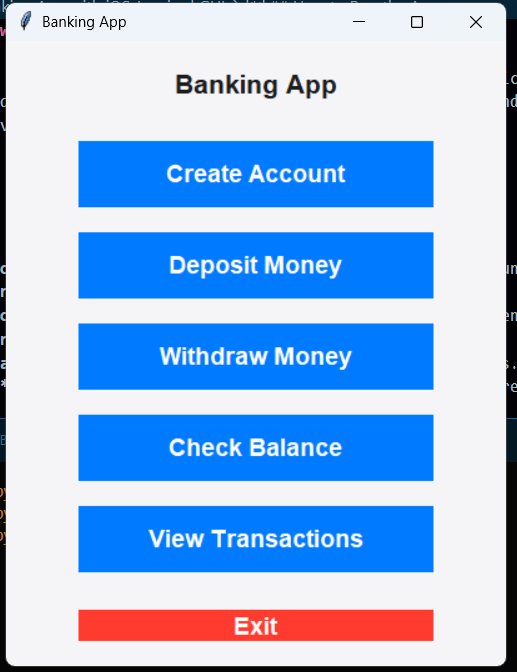

# Banking App with iOS-Inspired GUI

Welcome to the **Banking App**, a simple yet powerful banking application built with Python and `tkinter`. This app features a modern, colorful design inspired by iOS, making it visually appealing and user-friendly. It allows users to create accounts, deposit money, withdraw funds, check balances, and view transaction history.

---

## Features

- **Create Account**: Create a new bank account with a unique account number.
- **Deposit Money**: Add funds to your account.
- **Withdraw Money**: Withdraw funds from your account (if sufficient balance is available).
- **Check Balance**: View your current account balance.
- **View Transactions**: See a detailed history of all transactions.
- **Modern GUI**: A clean, colorful, and intuitive interface inspired by iOS design.

---

## Screenshots

  
*Example screenshot of the app in action.*

---

## Requirements

- Python 3.x
- `tkinter` (included with Python standard library)

---

## How to Run the App

1. **Clone the Repository**:
   ```bash
   git clone https://github.com/ShiboshreeRoy/bank_app.git
   cd bank-app